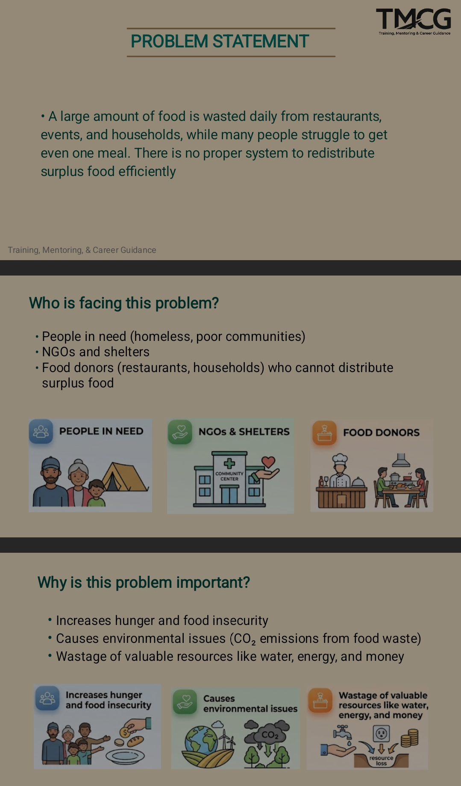
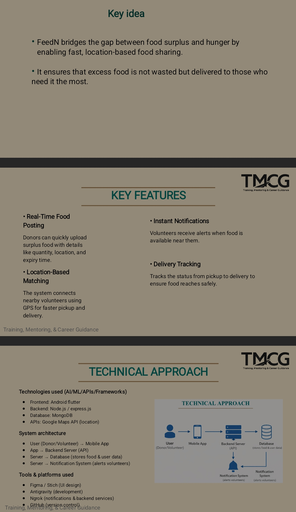
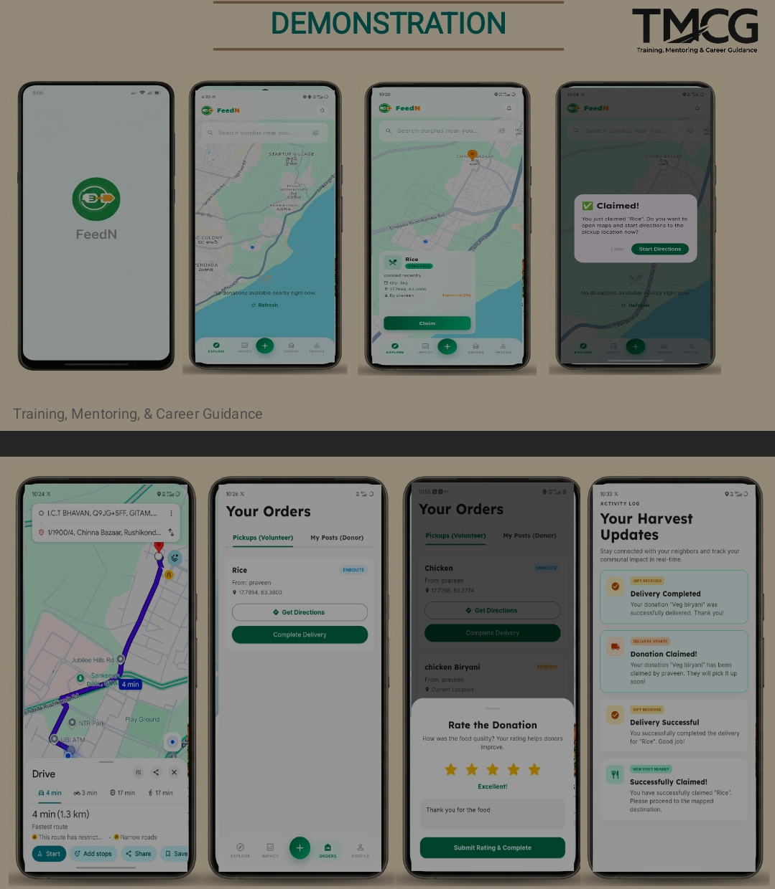

# FeedN - The Living Larder

**FeedN** (also known as **The Living Larder**) is a community-centric platform designed to bridge the gap between surplus food and those in need. Built with a focus on sustainability and community support, it enables users to donate food, track community fridge statuses, and manage food resources efficiently.

---

## 🏆 TMGC 24 Hours Sprint Hackathon
This project was conceptualized and developed within **24 hours** during the **TMGC 24 Hours Sprint Hackathon**. 

### 👥 Team Members
- **Yogeswar** ([@yogeswar142](https://github.com/yogeswar142))
- **Ganne Rohan** ([@GanneRohan097](https://github.com/GanneRohan097))
- Harish Naidu ([@GanneRohan097](https://github.com/HARISH-BN890))
- Deepak D
- M Tanooj KUmar

---

## 🚀 Key Features
- **Food Donation Tracking**: Seamlessly list and manage food donations.
- **Community Fridge Integration**: Real-time updates on community pantry/fridge availability.
- **Secure Authentication**: Robust user registration and login system.
- **Real-time API**: Powered by a scalable Node.js backend.

---

## 🖼️ Screenshots

<p align="center">
  
  
  
</p>

---

## 🛠️ Tech Stack

### Frontend
- **Framework**: Flutter
- **State Management**: Provider / Clean Architecture
- **Styling**: Google Fonts (Inter)

### Backend
- **Runtime**: Node.js
- **Framework**: Express.js
- **Database**: MongoDB (Mongoose)
- **Security**: Helmet, JWT, BcryptJS, Express Rate Limit

---

## 🏗️ Getting Started

### Prerequisites
- Flutter SDK
- Node.js & npm
- MongoDB Atlas account or local instance

### Installation

1. **Clone the repository**
   ```bash
   git clone https://github.com/yogeswar142/FeedN.git
   cd FeedN
   ```

2. **Setup Backend**
   ```bash
   cd backend
   npm install
   # Create a .env file with MONGODB_URI and JWT_SECRET
   npm start
   ```

3. **Setup Frontend**
   ```bash
   cd ../feedn
   flutter pub get
   flutter run
   ```

---

## 📄 License
This project is licensed under the ISC License.
